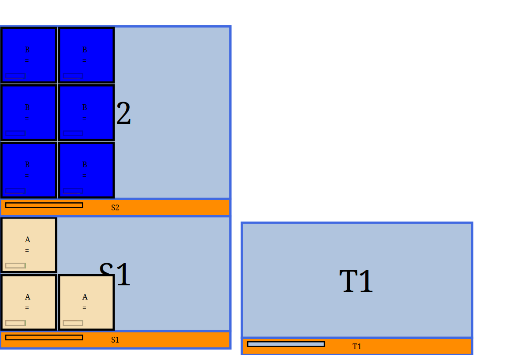
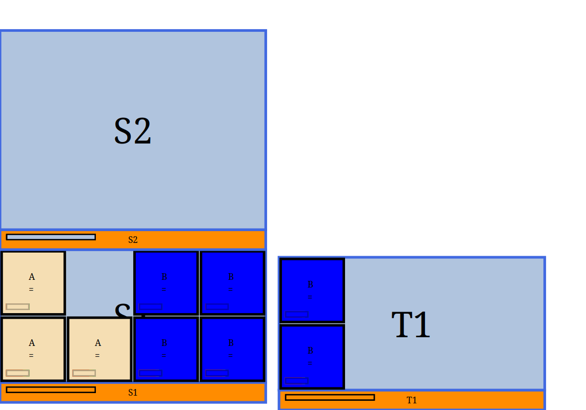

================
WarehousePlanner
================

WarehousePlanner is a tool designed to describe and display the layout of a warehouse
, focusing on where and how boxes are
positionned within shelfves. A warehouse is described using one or more text files and the tool can generate
reports or visually display the warehouse as interactive terminal application or generate images.

Features
--------

- Define warehouses with structured file formats.

- Import and manage boxes and shelves separately.

- Language to move and rearrange boxes.

- Different strategy to "fill" shelves with boxes.

- Aggregate multiple files into one using Org-mode.

- Utilize WPL for expressive warehouse descriptions.

- Generate reports for warehouse analysis.

- Display warehouse layouts with Brick. 

- Generate images with different styling.

Example
-------

A simple warehouse containing three shelves in two bays, with some boxes.

.. code-block:: orgmode

   This is a orgmode file. Each orgmode drawer contains a csv.
   What is between drawer (as the present text is ignored)

   The first drawer describes three shelves named respectively S1 , S2 and T1

   :SHELVES:
   name,comment,length,width,height,type
   S1,,200,50,100,Shelf
   S2,,200,50,150,Shelf
   T1,,200,50,100,Shelf
   :END:

   The second drawer describes the boxes and in which shelf they are.
   We have three boxes (called A) in S1 and six Bs in S2.
   B have been tagged as `bg=blue` to set the background in blue.

   :STOCKTAKE:
   Bay No,Style,QTY,Length,Width,Height,Orientations
   S1,A,3,50,50,50,
   S2,B#bg=blue,6,50,50,50,
   :END:

   Finally, we need to describe the layout (how are shelves related to each other).
   We want S2 to be on top of S1 and T1 next to it

   :LAYOUT:
   S1|S2 T1
   :END:

Can be viewed as 

   

Boxes can be then moved by adding

.. code-block:: orgmode

   The move section allows to move all the B to S1 and T1.
   :MOVES:
   boxes,location
   B,S1|T1
   :END:

